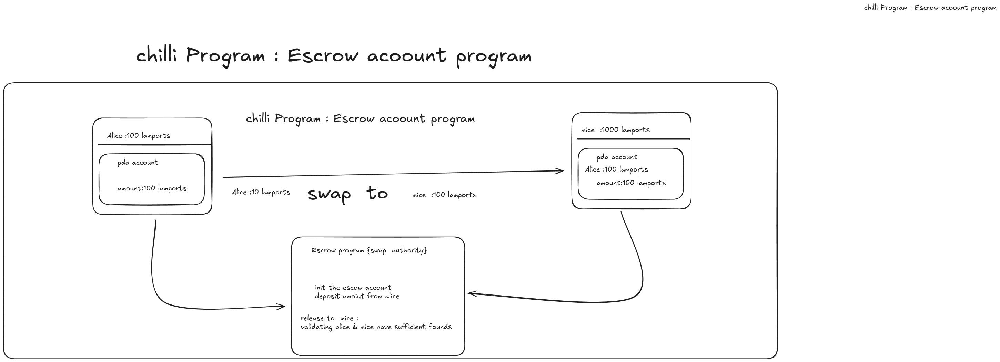

🧱 Chilli: Escrow + Vault System on Solana
Overview

Chilli is a decentralized vault and escrow system built on Solana using Anchor and SPL Token.
It allows users to safely deposit SPL tokens into a personal vault, and when certain conditions (like target amount or deal approval) are met,
the tokens are automatically released to an escrow that finalizes settlement between two parties.

🚀 Problem

In traditional token transactions, users frequently pay multiple transaction fees —
every deposit, every trade, every transfer incurs cost.
Similarly, in peer-to-peer trades, there is trust risk — one user can pay but not receive tokens.

💡 Solution

The Chilli Program solves this by combining:

Vaults → to accumulate user SPL tokens safely until a goal is met.

Escrow → to ensure fair exchange between users without trust.

Single Transaction Settlement → minimizing conversion and transaction fees.

👤 User Story
Meet Alex

Alex often trades DRT tokens for SOL with other users.
Each time, he pays a transaction fee and risks losing funds to bad actors.

Now, using Chilli:

Alex deposits his DRT tokens into his Vault.

Once his Vault reaches 1000 DRT, he moves them to the Escrow contract.

The Escrow automatically swaps or releases tokens only when both Alex and the counterparty approve.

Finally, the system transfers the resulting SOL directly to Alex’s wallet — safely, and with only one transaction fee.

Result:
✅ Safe trade
✅ Lower fees
✅ Automatic handling of funds

        ┌────────────────────────┐
        │        User Wallet     │
        │ (Holds DRT / SOL)      │
        └────────────┬───────────┘
                     │
                     ▼
        ┌────────────────────────┐
        │        Vault           │
        │  - Stores SPL Tokens   │
        │  - Tracks Target Amt   │
        │  - Releases on trigger │
        └────────────┬───────────┘
                     │
                     ▼
        ┌────────────────────────┐
        │        Escrow          │
        │  - Holds trade funds   │
        │  - Confirms parties    │
        │  - Executes swap       │
        └────────────┬───────────┘
                     │
                     ▼
        ┌────────────────────────┐
        │       Settlement       │
        │   - Converts DRT→SOL   │
        │   - Sends to wallet    │
        └────────────────────────┘

🔁 How It Works (Step-by-Step)

1️⃣ Initialize Vault

User creates a new vault and defines:

SPL token mint (e.g., DRT)

Target amount (e.g., 1000 DRT)
ts-node scripts/createVault.ts

2️⃣ Deposit Tokens

User deposits DRT into the vault:
ts-node scripts/depositVault.ts

3️⃣ Vault Reaches Target

Once the balance ≥ target, vault unlocks and allows funds to be moved.
4️⃣ Create Escrow

User moves funds to escrow:
ts-node scripts/createEscrow.ts
5️⃣ Finalize / Cancel

Finalize: Execute token conversion (DRT → SOL)

Cancel: Return DRT back to user vault
ts-node scripts/finalizeEscrow.ts

| Step           | Action              | Fee Paid       | Notes                   |
| -------------- | ------------------- | -------------- | ----------------------- |
| 1              | Deposit DRT → Vault | 1              | Locked                  |
| 2              | Vault Reaches 1000  | 0              | Unlocks                 |
| 3              | Move to Escrow      | 1              | Safe Lock               |
| 4              | Final Conversion    | 1              | Single Conversion       |
| **Total Fees** |                     | **2 tx only!** | Compare to 10+ normally |
🧩 Smart Contract Overview
🔸 Vault Logic

Stores SPL tokens in PDA.

Allows deposits.

Tracks progress and target amount.

Releases tokens only when conditions are met.

🔸 Escrow Logic

Holds tokens from two parties.

Confirms deal through both signatures.

Executes token swap or returns funds.

🔸 Security

PDAs prevent unauthorized access.

Anchor #[account] ensures proper ownership and seed handling.

Each step emits Solana logs for transparency.
🔐 Benefits

✅ Lower Transaction Fees
✅ Automated Fund Safety
✅ Seamless Token Conversion
✅ Transparent and Auditable
✅ Built Fully On-Chain

| Component | Purpose                              |
| --------- | ------------------------------------ |
| Vault     | Secure accumulation of user tokens   |
| Escrow    | Fair trade mechanism between parties |
| SPL Token | Standard for all token transactions  |
| Anchor    | Smart contract framework             |
| Solana    | Fast, low-fee blockchain             |
💬 Built By

Rahul Patle
🔥 Powered by Solana | Built with Anchor